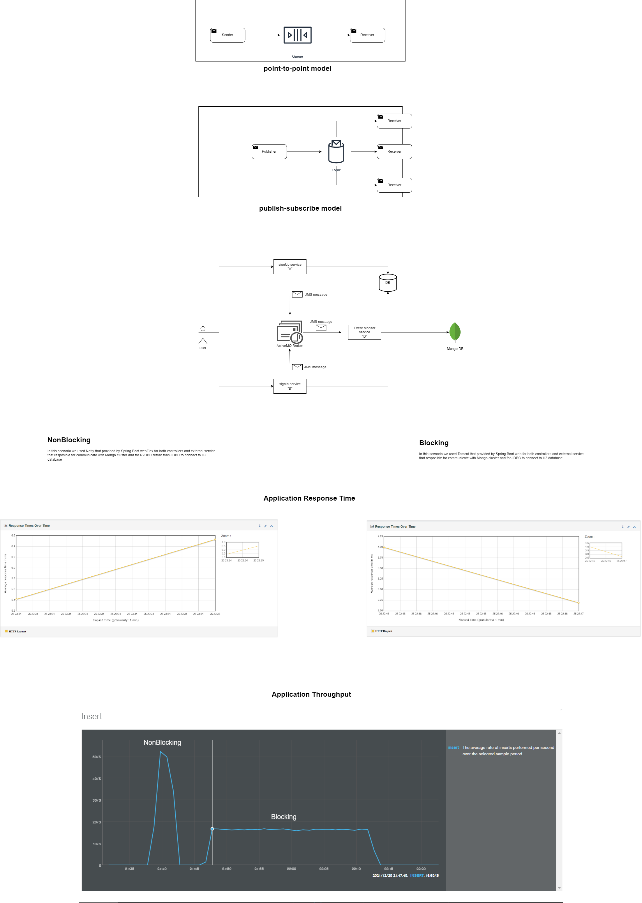

# ReactorPerformance
A small application with two different programming scenarios (reactive programming vs declarative programming)

The application responseTime measured by JMeter.
The application throughput measured on mongoDB console and represents the number of inserts per second.

